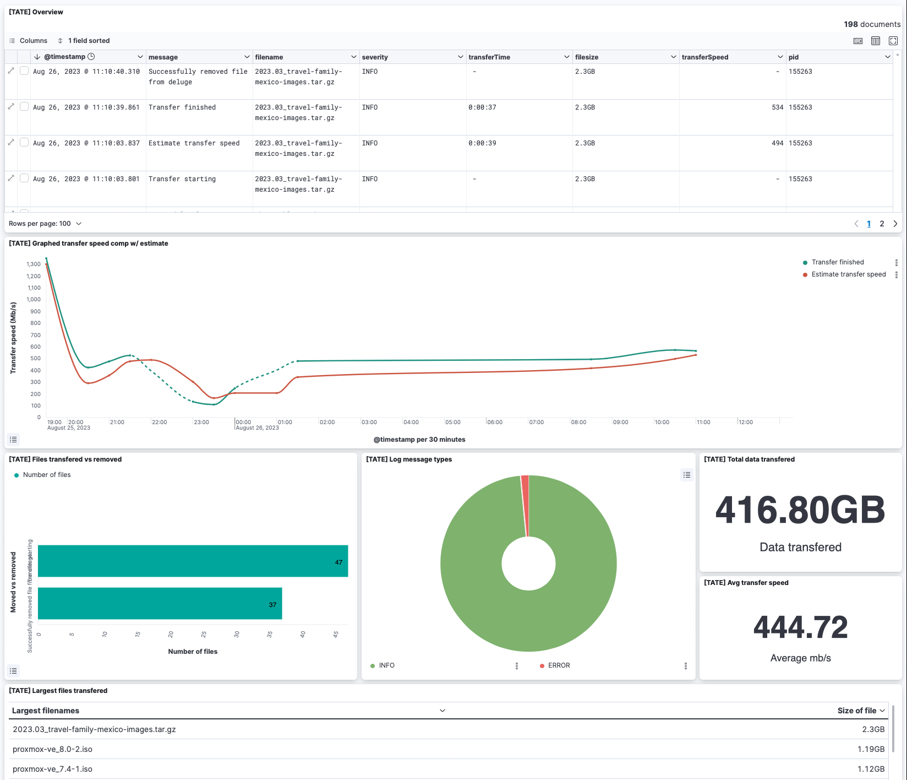

# 🚅 Transatlantic Torrent Express
> Agent for transporting files from remote host

Used for moving files and exports logs to follow progress. There might also be special characters in filesnames and as different types, so this handles this ~in a unit-testable way~.  


Example kibana dashboard:  


A kibana dashboard template can be imported from here: [kibana-TATE-dashboard.ndjson](assets/kibana-TATE-dashboard.ndjson)
 
## Install
Download repo:

```bash
git clone https://github.com/kevinmidboe/transatlanticTorrentExpress
cd transatlanticTorrentExpress
```

Also setup to require [delugeClient](https://github.com/KevinMidboe/delugeClient) to remove after transfered. Install the package using pip command: 
```bash
pip3 install delugeClient-kevin
```

## Configure
Create copy of config and edit following values:

```bash
cp config.ini.default config.ini
```

## Run

```bash
python3 transatlanticTorrentExpress.py
```
